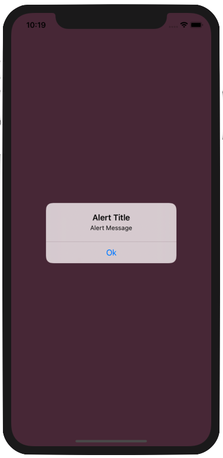

# Framework

How to create Universal Framework and use in iOS project using Xcode 12 [Medium.com](https://medium.com/@rohittamkhane/create-universal-framework-and-use-in-ios-project-using-xcode-12-6202dbe32a3f)

## Usage

1. Download the Framework demo project
2. Drag and drop RTTestFramework.framework in your project and check “Copy items if needed”.
3. Select the Project, Choose Target → Project Name → Select General → Scroll to “Embedded Binaries”. Press “+” and Add the framework.
4. Import framework 

```swift
import RTTestFramework
```
5. Use below code to get color from hex string and display alert

```swift
  // Get Color from hex string
  hexStringToUIColor(hex: "#543444")
  
  //Display Alert
  displayAlert(viewController: self, title: "Alert Title", message: "Alert Message")
  
```

## Screenshots


